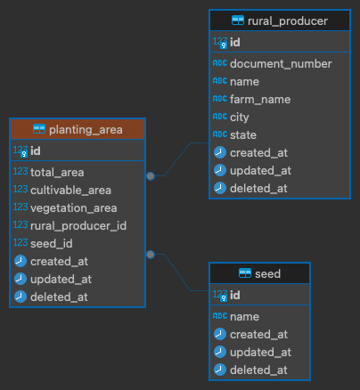

# Teste de Aptidão Node.js com Nest.js

### Requisitos para Execução

Para executar o projeto, é necessário ter o Docker instalado na máquina. Caso não tenha, siga as instruções de instalação no site oficial: [Instalar Docker](https://docs.docker.com/get-docker/)

## Execução

O processo de execução do projeto foi automatizado. Basta seguir os passos abaixo:

### Ambiente de Desenvolvimento

Como o projeto está configurado apenas para ambiente de desenvolvimento, utilize o comando abaixo:

**Iniciar a Aplicação**

```bash
  docker-compose up --build
```

Acesse o Swagger emv localhost:3000/docs - [Acesse a documentação](http://localhost:3000/docs)

### Assim que acessar a página do Swagger, execute os seguintes passos

Popular Banco de Dados: Execute o endpoint `POST /create-database-seed` para popular a base de dados com dados de teste.

## Modelo de Banco de Dados

O banco de dados foi estruturado com base nas seguintes entidades principais:

1. Produtores Rurais: Tabela que armazena as informações dos produtores rurais.
2. Áreas de Cultivo: Tabela que armazena as áreas de cultivo vinculadas a um produtor rural.
3. Sementes: Tabela que armazena as sementes plantadas em cada área de cultivo.

Essa estrutura permite que um produtor tenha várias áreas de cultivo, e cada área de cultivo possa ter diferentes sementes associadas.

### Diagrama do Banco de Dados



#### Objetivo

A divisão em três entidades principais facilita a escalabilidade e manutenção do projeto, permitindo que um produtor possa gerenciar suas áreas de cultivo e sementes de forma independente.

### Tecnologias Utilizadas

As seguintes tecnologias foram usadas no desenvolvimento do projeto:

1. Nest.js: Framework robusto para construção de APIs escaláveis em Node.js.
2. TypeORM: ORM para manipulação de dados com suporte a diferentes bancos de dados, como o PostgreSQL.
3. Docker: Para containerização e facilidade na execução do projeto em diferentes ambientes.
4. PostgreSQL: Banco de dados relacional, escolhido pela robustez e escalabilidade.

### Descrição do Desafio

O objetivo do teste é avaliar as habilidades do candidato em lógica de programação, regras de negócio e arquitetura orientada a objetos.

A aplicação permite o cadastro de produtores rurais com os seguintes dados:

1. CPF ou CNPJ
2. Nome do produtor
3. Nome da fazenda
4. Cidade
5. Estado
6. Área total da fazenda (hectares)
7. Área agricultável (hectares)
8. Área de vegetação (hectares)
9. Culturas plantadas (ex: Soja, Milho, Algodão, Café, Cana de Açúcar)
